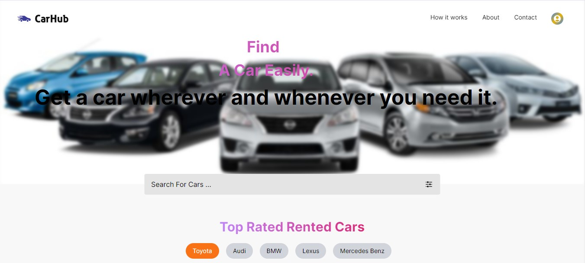
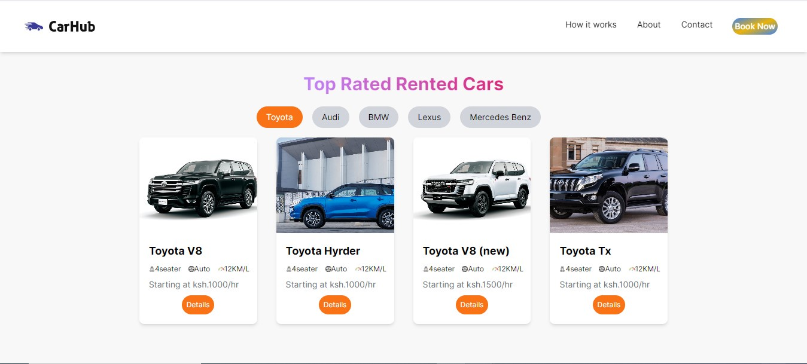
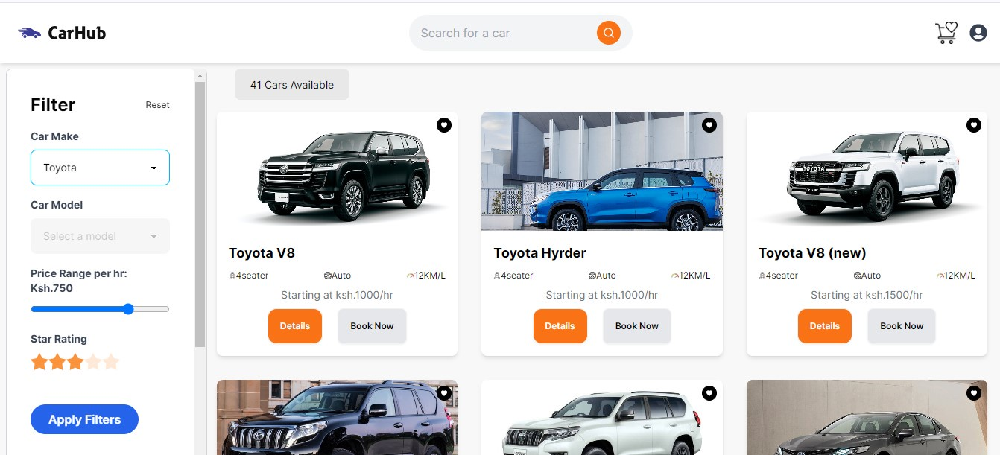

<h1 align="center">
  <a href="https://github.com/khalifahnur/car-rental-reservation-system">
    
  </a>
</h1>

<div align='center'>
    Car Rental Reservation System
</div>


<details open="open">
  <summary>Table of Contents</summary>
  <ul>
    <li><a href="#about">About</a></li>
    <li><a href="#screenshots">Screenshots</a></li>
    <li><a href="#dependencies">Dependencies</a></li>
    <li><a href="#getting-started">Getting Started</a></li>
    <ul>
      <li><a href="#firebase-setup">Firebase Setup</a></li>
      <li><a href="#usage">Usage</a></li>
      <ul>
        <li><a href="#step-1-install-dependencies">Install Dependencies</a></li>
        <li><a href="#step-2-start-the-server">Start the Server</a></li>
        <li><a href="#step-3-open-the-application">Open the Application</a></li>
      </ul>
    </ul>
    <li><a href="#contributing">Contributing</a></li>
    <li><a href="#contributors">Contributors</a></li>
  </ul>
</details>

---

## ScreenShots
<a href="https://github.com/khalifahnur/car-rental-reservation-system">
    
</a>
<a href="https://github.com/khalifahnur/car-rental-reservation-system">
    
</a>
<a href="https://github.com/khalifahnur/car-rental-reservation-system">
  
</a>


## About
Car Hub is a Car Rental Reservation System that is a modern web application built with Next.js 14 and Tailwind CSS, leveraging Redux Toolkit for state management. It integrates Firebase SDK for authentication and Firestore for real-time database functionality. Mapbox is utilized for location services, enhancing the user experience. Context API is employed for efficient state management and data sharing across components.

This system allows users to browse and search for available vehicles by location, date, and type, facilitating seamless reservation bookings. Users can securely sign in, manage their profiles, and receive notifications for booking confirmations and updates. With intuitive UI/UX design and responsive layout, the Car Rental Reservation System provides a user-friendly experience for both desktop and mobile users.

## Dependencies

To run the Car Rental Reservation System, ensure you have the following dependencies installed:

- Nextjs 14
- Tailwind CSS
- Firebase
- Bcrypt
- Dotenv
- Redux Toolkit
- Daisy UI
- Framer Motion
## Getting Started
## Firebase Setup

### Creating a Firebase Account

1. Go to the [Firebase Console](https://console.firebase.google.com/) and sign in with your Google account.
2. Click on "Add Project" and follow the prompts to create a new Firebase project.
3. Once the project is created, you'll be redirected to the project dashboard.

### Configuring Admin SDK

1. In the Firebase Console, navigate to "Project settings" (gear icon) > "Service accounts" tab.
2. Click on "Generate new private key" to download a JSON file containing your service account credentials.
3. Rename the downloaded JSON file to `serviceAccountKey.json`.
4. Place `serviceAccountKey.json` in the root directory of your project.

### Configuring Client SDK

1. In the Firebase Console, navigate to "Project settings" (gear icon) > "General" tab.
2. Under "Your apps", click on the web icon (`</>`) to add a new web app.
3. Follow the setup instructions to register your app and obtain your Firebase configuration settings.

### Setting Up Environment Variables

1. Create a new file named `.env` in the root directory of your project.
2. Add the following variables to `.env`:

```plaintext
# Firebase Admin SDK Configuration
FIREBASE_TYPE=service_account
FIREBASE_PROJECT_ID=your-project-id
FIREBASE_PRIVATE_KEY_ID=your-private-key-id
FIREBASE_PRIVATE_KEY=your-private-key
FIREBASE_CLIENT_EMAIL=your-client-email
FIREBASE_CLIENT_ID=your-client-id
FIREBASE_AUTH_URI=https://accounts.google.com/o/oauth2/auth
FIREBASE_TOKEN_URI=https://oauth2.googleapis.com/token
FIREBASE_AUTH_PROVIDER_X509_CERT_URL=https://www.googleapis.com/oauth2/v1/certs
FIREBASE_CLIENT_X509_CERT_URL=https://www.googleapis.com/robot/v1/metadata/x509/firebase-adminsdk.json

# Firebase Web SDK Configuration
REACT_APP_FIREBASE_API_KEY=your-api-key
REACT_APP_FIREBASE_AUTH_DOMAIN=your-auth-domain
REACT_APP_FIREBASE_PROJECT_ID=your-project-id
REACT_APP_FIREBASE_STORAGE_BUCKET=your-storage-bucket
REACT_APP_FIREBASE_MESSAGING_SENDER_ID=your-messaging-sender-id
REACT_APP_FIREBASE_APP_ID=your-app-id
REACT_APP_FIREBASE_MEASUREMENT_ID=your-measurement-id
```

# Usage

## Step 1: Install Dependencies

To install all the dependencies, run the following command in the terminal:

```bash
npm install
```
## Step 2: Start the Server

Run the following command in the terminal to start the server:

```bash
npm start
```
## Step 3: Open the Application

Open your preferred web browser and go to the following link:

[http://localhost:3000](http://localhost:3000)

This will open the Car Rental Reservation System in your browser, allowing you to interact with the application.

## Contributing

First off, thanks for taking the time to contribute! Contributions are what makes the open-source community such an amazing place to learn, inspire, and create. Any contributions you make will benefit everybody else and are **greatly appreciated**.

Please try to create bug reports that are:

- _Reproducible._ Include steps to reproduce the problem.
- _Specific._ Include as much detail as possible: which version, what environment, etc.
- _Unique._ Do not duplicate existing opened issues.
- _Scoped to a Single Bug._ One bug per report.

Please adhere to this project's [code of conduct](docs/CODE_OF_CONDUCT.md).

## Contributors

- Khalif Noor
